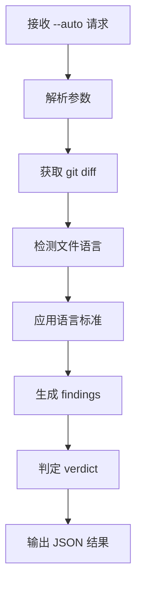

# Auto Mode Review

**Purpose:** 专为 harness-work 等自动化流程设计的代码审查模式

## 核心设计原则

### 1. 快速响应
- 目标响应时间: < 5秒 (小变更) / < 30秒 (中型变更)
- 增量检查: 只审查变更的文件和行
- 缓存优化: 重用语言检测结果

### 2. 标准化输出
- 统一的 JSON 格式
- 清晰的 verdict 规则
- 机器可读的 finding 结构

### 3. 智能判断
- 自动语言检测
- 适当的严重程度判定
- 可配置的严格度

## 工作流程



## Verdict 判定规则

### 严格模式 (strict)
```python
if any(critical_issues) or any(major_issues):
    verdict = "REQUEST_CHANGES"
else:
    verdict = "APPROVE"
```

### 宽松模式 (lenient)
```python
critical_count = count(findings.severity == "critical")
if critical_count > 0:
    verdict = "REQUEST_CHANGES"
else:
    verdict = "APPROVE"
```

## 多语言支持

### 自动检测流程
1. **扩展名检测**: `.java`, `.py`, `.vue`, `.go` 等
2. **内容分析**: shebang、import 语句等
3. **多语言文件**: 特殊处理 (如 `.vue` 文件)

### 标准应用
- **Java**: Alibaba Java Development Guide (黄山版)
- **Python**: PEP 8 + Python Best Practices  
- **Vue**: Vue Style Guide
- **Go**: Effective Go + Go Code Review Comments

## 性能优化

### 1. 增量审查
```bash
# 只审查变更的部分
git diff --name-only ${BASE_REF}..HEAD
```

### 2. 语言缓存
```python
# 避免重复检测
language_cache = {}
def detect_language(file_path):
    if file_path in language_cache:
        return language_cache[file_path]
    result = detect_language_internal(file_path)
    language_cache[file_path] = result
    return result
```

### 3. 并行处理
```python
# 并行审查多个文件
from concurrent.futures import ThreadPoolExecutor
with ThreadPoolExecutor(max_workers=4) as executor:
    results = executor.map(review_file, changed_files)
```

## 错误处理

### 优雅降级
```python
try:
    # 尝试完整的多语言检查
    findings = perform_full_review(files)
except Exception as e:
    logger.warning(f"Full review failed, using fallback: {e}")
    # 降级到基础检查
    findings = perform_basic_review(files)
```

### 超时处理
```python
import signal

def timeout_handler(signum, frame):
    raise TimeoutError("Review timeout")

signal.signal(signal.SIGALRM, timeout_handler)
signal.alarm(30)  # 30秒超时
try:
    result = perform_review()
finally:
    signal.alarm(0)
```

## 集成示例

### harness-work 调用示例
```python
def call_harness_review_auto(base_ref, worktree_path):
    import subprocess
    import json
    
    # 调用 harness-review --auto
    cmd = [
        "harness-review", "--auto",
        "--base-ref", base_ref,
        "--output", "/tmp/review-result.json",
        "--mode", "strict"
    ]
    
    result = subprocess.run(cmd, capture_output=True, text=True)
    
    # 读取结果
    with open("/tmp/review-result.json") as f:
        review_result = json.load(f)
    
    return review_result
```

### 结果处理
```python
# 获取审查结果
result = call_harness_review_auto(BASE_REF, worktree_path)

# 检查 verdict
if result["verdict"] == "APPROVE":
    # 继续流程
    proceed_with_commit()
else:
    # 处理问题
    handle_findings(result["findings"])
```

## 质量保证

### 测试覆盖
1. **单元测试**: 各语言检测逻辑
2. **集成测试**: 完整审查流程
3. **性能测试**: 响应时间验证
4. **边界测试**: 极端情况处理

### 监控指标
- 平均响应时间
- 审查准确率
- 假阳性率
- 系统可用性

## 配置选项

### .claude/settings.json
```json
{
  "harness": {
    "review": {
      "auto_mode": {
        "timeout": 30,
        "parallel_workers": 4,
        "cache_enabled": true,
        "fallback_enabled": true
      }
    }
  }
}
```

### 环境变量
```bash
HARNESS_REVIEW_TIMEOUT=30
HARNESS_REVIEW_PARALLEL=4
HARNESS_REVIEW_CACHE=true
```

## 故障排除

### 常见问题
1. **超时**: 增加超时时间或优化文件数量
2. **内存不足**: 减少并行worker数量
3. **语言检测失败**: 检查文件扩展名支持
4. **JSON格式错误**: 验证输出文件完整性

### 调试模式
```bash
# 启用详细日志
HARNESS_REVIEW_DEBUG=1 /harness-review --auto --debug
```
